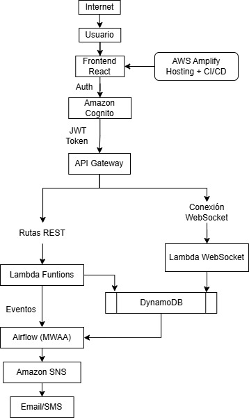

# AlertaUTEC – Sistema de Gestión de Incidentes

* Camila Espinoza
* Gabriel Frisancho

## 🚨 Descripción

**AlertaUTEC** es una plataforma **100% serverless** para reportar, gestionar y dar seguimiento a incidentes dentro del campus universitario en tiempo real, desarrollada para la Universidad de Ingeniería y Tecnología (UTEC).

---

## 🏗️ Arquitectura de Solución



### Componentes Principales

* **Frontend**: React + TypeScript, desplegado en AWS Amplify
* **Backend**: API Gateway + Lambda Functions + DynamoDB
* **Procesamiento**: Apache Airflow para orquestación
* **Almacenamiento**: Amazon DynamoDB (NoSQL)
* **Autenticación**: Amazon Cognito *(pendiente)*

---

## 🌐 Enlaces de Despliegue

### Frontend (Producción)

* **URL**: [https://main.dcwturr2pq5e2.amplifyapp.com/](https://main.dcwturr2pq5e2.amplifyapp.com/)

### Backend (API REST)

* **POST /incidentes**: [https://sjksicdqld.execute-api.us-east-1.amazonaws.com/dev/incidentes](https://sjksicdqld.execute-api.us-east-1.amazonaws.com/dev/incidentes)
* **GET /incidentes**: [https://sjksicdqld.execute-api.us-east-1.amazonaws.com/dev/incidentes](https://sjksicdqld.execute-api.us-east-1.amazonaws.com/dev/incidentes)
* **GET /incidentes/{id}**: [https://sjksicdqld.execute-api.us-east-1.amazonaws.com/dev/incidentes/{id}](https://sjksicdqld.execute-api.us-east-1.amazonaws.com/dev/incidentes/{id})
* **PUT /incidentes/{id}**: [https://sjksicdqld.execute-api.us-east-1.amazonaws.com/dev/incidentes/{id}](https://sjksicdqld.execute-api.us-east-1.amazonaws.com/dev/incidentes/{id})

---

## 🚀 Características Implementadas

### ✅ Completado

* [x] Backend serverless con Lambda y API Gateway
* [x] DynamoDB para almacenamiento
* [x] API REST completa (CRUD)
* [x] Frontend en React + TS
* [x] CI/CD con Amplify
* [x] Procesamiento automático con Airflow

### 🚧 En Progreso

* [ ] Autenticación con Amazon Cognito
* [ ] Panel administrativo avanzado
* [ ] WebSockets para notificaciones
* [ ] Integración con Amazon SNS

---

## 🔧 Instalación y Despliegue

### Prerrequisitos

* Node.js 16+
* Python 3.8+
* AWS CLI configurado
* Cuenta de AWS con permisos adecuados

---

### Backend (Serverless Framework)

```bash
cd backend
npm install -g serverless
serverless deploy
```

### Frontend (React)

```bash
cd frontend
npm install
npm run build
```

### Airflow (Procesamiento Automático)

```bash
cd airflow
pip install apache-airflow
airflow db init
airflow webserver --port 8080
airflow scheduler
```

---

## 📊 Flujo de Datos

1. **Reporte**: Usuario envía incidente → API Gateway → Lambda → DynamoDB
2. **Procesamiento**: Airflow revisa incidentes pendientes y los clasifica
3. **Notificación**: Incidentes críticos generan alertas
4. **Seguimiento**: Panel administrativo actualiza estados

---

## 🤖 Procesamiento Automático con Airflow

El DAG `alerta_utec_processor` se ejecuta cada **10 minutos** y:

* Clasifica automáticamente incidentes según urgencia
* Actualiza DynamoDB con la nueva clasificación
* Genera alertas en caso de incidentes críticos
* Produce un reporte diario de estadísticas

---

## 🛠️ Tecnologías Utilizadas

### Frontend

* React 18
* TypeScript
* AWS Amplify

### Backend

* AWS Lambda (Python)
* Amazon API Gateway
* Amazon DynamoDB
* Serverless Framework

### Orquestación

* Apache Airflow
* Amazon MWAA

### DevOps

* AWS Amplify (CI/CD)
* AWS IAM

---

## 📝 API Reference

### Crear Incidente

**POST /incidentes**

```json
{
  "tipo": "Infraestructura",
  "ubicacion": "Edificio A",
  "descripcion": "Fuga de agua en baño del segundo piso",
  "urgencia": "alta"
}
```

---

### Listar Incidentes

**GET /incidentes**

---

### Obtener Incidente Específico

**GET /incidentes/{id}**

---

### Actualizar Incidente

**PUT /incidentes/{id}**

```json
{
  "estado": "en atencion",
  "urgencia": "alta"
}
```

## 👥 Roles de Usuario

* **Estudiante**: Reportar incidentes, consultar estado
* **Personal Administrativo**: Gestionar y actualizar estados
* **Autoridad**: Acceso total, reportes y análisis

